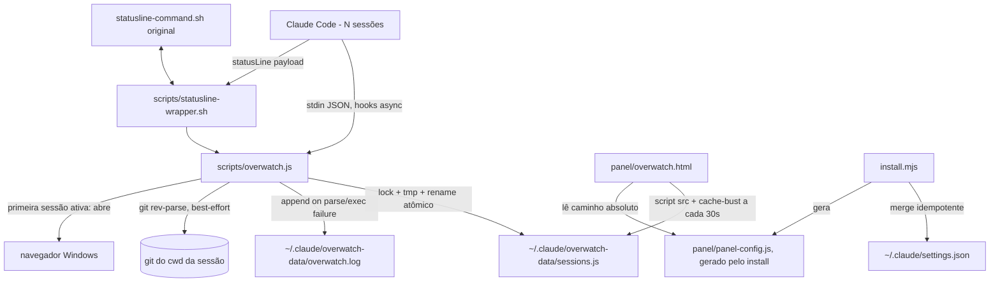

# Session Overwatch Panel Design

**Spec**: `.specs/features/session-overwatch-panel/spec.md`
**Status**: Draft

---

## Architecture Overview

Arquitetura já decidida e aprovada pelo usuário em `docs/design-spec.md` (não há abordagens alternativas a comparar — este documento formaliza essa decisão em componentes e interfaces implementáveis, e resolve os pontos que o design original deixava em aberto).

Um único script Node sem dependências externas (`scripts/overwatch.js`) é invocado por 6 hooks do Claude Code (todos `async: true`, mesmo padrão já em produção em `~/.claude/settings.json`). Cada invocação lê o payload do hook via stdin, faz um read-modify-write protegido por lock de arquivo sobre `~/.claude/overwatch-data/sessions.js`, e sai. O painel (`panel/overwatch.html`) é um arquivo estático aberto via `file://` que recarrega esse `sessions.js` a cada 30s via tag `<script>` (contorna a restrição de CORS do Chrome para `fetch`/`XHR` em `file://`).



---

## Code Reuse Analysis

### Existing Components to Leverage

| Component | Location | How to Use |
| --- | --- | --- |
| Padrão de script de hook sem deps | `~/.claude/scripts/track-usage.js` | Mesmo esqueleto: `readStdin` síncrono via fd 0, `try/catch` silencioso no parse, escrita via `.tmp` + `fs.renameSync` atômico, nunca lança exceção que quebre o hook |
| `statusline-command.sh` (já instalado, funcional) | `~/.claude/statusline-command.sh` | **Não editar.** `statusline-wrapper.sh` chama este script depois de repassar o stdin para `overwatch.js`, e imprime a saída dele sem alteração |
| Campos de `context_window` já em uso | `~/.claude/statusline-command.sh:6-11` | `overwatch.js statusline` lê os mesmos campos (`context_window.used_percentage`, `.remaining_percentage`, `.current_usage.input_tokens`, `.context_window_size`, `model.display_name`) do mesmo payload JSON |
| Estrutura de hooks já em produção | `~/.claude/settings.json` | Cada evento (`PostToolUse`, `Stop`, etc.) é um **array** de grupos `{ matcher?, hooks: [...] }` — `install.mjs` deve empurrar novos grupos para esses arrays, nunca substituir o array inteiro (haveria hooks pré-existentes do usuário: `SubagentStart`/track-usage, `PostToolUse`/Skill, `Stop`/notify-stop.ps1) |
| Padrão `"async": true` | `~/.claude/settings.json` (todas as entradas atuais) | Confirmado em uso real nesta máquina; todo hook novo do overwatch usa o mesmo campo |

### Integration Points

| System | Integration Method |
| --- | --- |
| `~/.claude/settings.json` (hooks) | `install.mjs` faz merge por evento: para cada evento da tabela da spec, garante que exista um grupo cujo `command` já contenha `overwatch.js`; se não existir, faz `push` de um novo grupo no array existente (ou cria o array se o evento não existir ainda). Nunca remove ou reordena grupos de outras ferramentas |
| `~/.claude/settings.json` (`statusLine.command`) | Único campo que é **substituído** (não é array, é um objeto singular) — `install.mjs` grava o comando original em uma variável de ambiente/arquivo que o wrapper lê, ou embute o comando original como argumento do wrapper (decisão abaixo, ver Tech Decisions) |
| Git (branch da sessão) | `child_process.execSync('git rev-parse --abbrev-ref HEAD', { cwd, stdio: [...] })` síncrono, com timeout curto e `try/catch` — nunca bloqueia o hook por mais que o timeout |
| Navegador padrão do Windows | `child_process.exec('start "" "<caminho-absoluto-do-html>"')` (comando `start` do `cmd.exe`, disparado via `shell: true` ou `cmd /c start`) |

---

## Components

### `scripts/overwatch.js`

- **Purpose**: Único ponto de entrada Node para todos os 7 sub-eventos (`session-start`, `prompt`, `todo`, `waiting`, `idle`, `session-end`, `statusline`); lê stdin, atualiza `sessions.js` com lock, nunca lança.
- **Location**: `scripts/overwatch.js`
- **Interfaces** (funções internas, sem exports — é um script executável, não uma lib):
  - `readStdinJson(): object` - lê fd 0 síncrono, `JSON.parse` com fallback `{}` em erro (loga em `overwatch.log`)
  - `withSessionsLock(mutateFn: (sessions: Record<string, Session>) => void): void` - adquire lock (`sessions.js.lock`, `wx` + retry + detecção de lock órfão), chama `mutateFn` sobre o objeto carregado, grava via tmp+rename, libera lock
  - `loadSessions(): Record<string, Session>` - lê e faz parse de `sessions.js` (formato `window.CLAUDE_SESSIONS = {...}`, extrai o objeto via regex/`Function` de forma segura o bastante para um arquivo que só o próprio script escreve); retorna `{}` se ausente/corrompido
  - `writeSessionsFile(sessions: Record<string, Session>): void` - serializa como `window.CLAUDE_SESSIONS = ${JSON.stringify(sessions, null, 2)};\n`
  - `resolveBranch(cwd: string): string | null` - `git rev-parse --abbrev-ref HEAD` best-effort
  - `isAnyOtherSessionActive(sessions, selfId): boolean` - TTL de 20min + `status !== 'ended'`
  - `openPanelIfFirstSession(sessions, selfId): void` - dispara `start` apontando para `panel/overwatch.html` (caminho absoluto do próprio repo, derivado de `__dirname`)
  - `logError(event: string, message: string): void` - append JSON-line em `overwatch.log`
  - Um handler por sub-evento (`handleSessionStart`, `handlePrompt`, `handleTodo`, `handleWaiting`, `handleIdle`, `handleSessionEnd`, `handleStatusline`), cada um puro sobre o objeto `sessions` já carregado dentro do lock
- **Dependencies**: apenas módulos nativos do Node (`fs`, `path`, `os`, `child_process`) - zero deps externas, mesmo espírito de `track-usage.js`
- **Reuses**: esqueleto de `~/.claude/scripts/track-usage.js` (leitura de stdin, parse defensivo, escrita atômica)

### `scripts/statusline-wrapper.sh`

- **Purpose**: Intercepta o payload do `statusLine`, repassa para `overwatch.js statusline` (grava `context_pct`), depois repassa o mesmo stdin ao `statusline-command.sh` original e imprime a saída dele inalterada.
- **Location**: `scripts/statusline-wrapper.sh`
- **Interfaces**: nenhuma (script de shell, chamado pelo runtime do Claude Code com o payload via stdin)
- **Dependencies**: `bash`, `node`, o `statusline-command.sh` original do usuário (caminho fixo `~/.claude/statusline-command.sh`, nunca movido/editado)
- **Reuses**: nenhum código — é um wrapper puro; a lógica de extração de métricas fica em `overwatch.js`, não duplicada em shell

Mecânica: lê stdin uma vez para uma variável (`input=$(cat)`), passa `"$input"` via `echo` para `node overwatch.js statusline`, depois passa `"$input"` de novo via `echo` para `bash ~/.claude/statusline-command.sh` e imprime seu stdout. Se `overwatch.js statusline` falhar por qualquer razão, o `||true` garante que o wrapper segue para o script original de qualquer forma (a status line do terminal nunca pode quebrar por causa do overwatch).

### `install.mjs`

- **Purpose**: Merge idempotente de hooks em `~/.claude/settings.json` + geração de `panel/panel-config.js` com o caminho absoluto de `sessions.js` e do próprio repo.
- **Location**: `install.mjs` (raiz do repo)
- **Interfaces**:
  - `mergeHooks(settings: object, repoRoot: string): object` - para cada evento/matcher/command da tabela de hooks, garante presença sem duplicar (chave de idempotência: `command` contém o caminho absoluto de `overwatch.js` **e** o mesmo argumento de sub-evento)
  - `mergeStatusLine(settings: object, repoRoot: string): object` - se `statusLine.command` já não for o wrapper deste repo, salva o comando atual em `scripts/statusline-original-command.txt` (gerado, git-ignorado) e substitui por `bash "<repoRoot>/scripts/statusline-wrapper.sh"`
  - `writePanelConfig(repoRoot: string): void` - escreve `panel/panel-config.js` com `window.OVERWATCH_DATA_URL` apontando para `file:///<home>/.claude/overwatch-data/sessions.js` (barras normalizadas para URL de arquivo)
- **Dependencies**: `fs`, `path`, `os` nativos
- **Reuses**: nenhum (script novo, mas idempotência inspirada no mesmo cuidado de não quebrar hooks de terceiros já visto em `~/.claude/settings.json`)

### `panel/overwatch.html`

- **Purpose**: Renderiza os cards de sessão a partir de `window.CLAUDE_SESSIONS`, recarregando a cada 30s sem reload de página.
- **Location**: `panel/overwatch.html` (+ `panel/panel-config.js`, gerado pelo install, git-ignorado)
- **Interfaces** (funções JS internas):
  - `reloadSessionsScript(): void` - remove a tag `<script>` anterior (se houver), injeta uma nova com `src = `${OVERWATCH_DATA_URL}?t=${Date.now()}`` e `onload = render`
  - `render(sessions: Record<string, Session>): void` - separa ativas vs. arquivadas (TTL 20min / `status === 'ended'`), monta os cards
  - `renderCard(id: string, session: Session): HTMLElement`
  - `renderTodoItem(todo: {content, status}): HTMLElement` - extrai sub-progresso via regex `(\d+)\s*\/\s*(\d+)`
  - `formatElapsed(startedAt: string): string`
- **Dependencies**: nenhuma lib externa; fonte `Space Mono` via Google Fonts (mesma já usada no site-casara) ou fallback `monospace` caso o `file://` bloqueie a requisição externa
- **Reuses**: direção visual do *God's Eye View* (só estilo — vidro fosco, glow, mono), não código

---

## Data Models

### `Session` (entrada dentro de `window.CLAUDE_SESSIONS`, chave = `session_id`)

```typescript
interface Session {
  session_id: string;
  project: string;         // basename(cwd)
  cwd: string;
  branch: string | null;   // null se não for repo git
  summary: string;         // 80 primeiros chars do último prompt
  started_at: string;      // ISO 8601
  last_update: string;     // ISO 8601
  ended_at: string | null;
  context_pct: number | null; // null até o primeiro evento statusline
  status: "running" | "waiting" | "idle" | "error" | "ended";
  todos: Array<{ content: string; status: "pending" | "in_progress" | "completed" }>;
}
```

**Relationships**: nenhuma — objeto plano, chave única `session_id`, sem referências cruzadas.

**Arquivo físico**: `window.CLAUDE_SESSIONS = { [session_id]: Session, ... };` em `~/.claude/overwatch-data/sessions.js`. `.js` (não `.json`) para carregar via `<script src>` sem CORS em `file://`.

---

## Error Handling Strategy

| Error Scenario | Handling | User Impact |
| --- | --- | --- |
| Payload do hook não é JSON válido | `JSON.parse` em try/catch, loga em `overwatch.log`, `process.exit(0)` sem alterar `sessions.js` | Nenhum — hook do Claude Code segue normalmente, card daquela sessão só não atualiza neste ciclo |
| Lock (`sessions.js.lock`) não adquirido após 10 tentativas | Loga em `overwatch.log`, `process.exit(0)` sem escrever | Uma atualização é perdida; a próxima escrita (próximo evento) volta a tentar |
| Lock com mtime > 5s (órfão, processo morto) | Remove o `.lock` e tenta adquirir de novo imediatamente | Nenhum, recuperação automática |
| `git rev-parse` falha (não é repo git, ou timeout) | `branch: null`, sem lançar | Painel mostra "—" no lugar da branch |
| `sessions.js` ausente/corrompido na leitura do painel | `render` trata como `{}` e mostra estado vazio com mensagem | Painel funcional, sem stack trace no console |
| `panel-config.js` ausente (install.mjs nunca rodou) | HTML detecta `window.OVERWATCH_DATA_URL` indefinido e mostra instrução para rodar `node install.mjs` | Sem tela em branco/erro JS |
| `install.mjs` rodado 2ª vez | Cada merge é idempotente por chave (comando+evento); `panel-config.js` é sobrescrito com o caminho corrente (pode mudar se o repo foi movido) | Nenhuma duplicação de hook |

---

## Risks & Concerns

| Concern | Location (file:line) | Impact | Mitigation |
| --- | --- | --- | --- |
| `statusLine.command` atual do usuário é substituído por um wrapper; se `install.mjs` tiver um bug na etapa de merge, a status line do terminal (já funcional hoje) pode parar de funcionar | `~/.claude/settings.json:41-44` | Regressão visível a cada prompt no terminal, fora do escopo desta feature | `install.mjs` salva o comando original antes de sobrescrever (`statusline-original-command.txt`); o wrapper sempre executa esse comando salvo por último, nunca hardcoded; Tarefa de Execute inclui teste manual do wrapper antes de apontar o `settings.json` real para ele |
| `sessions.js` é interpretado como `window.CLAUDE_SESSIONS = {...}` — se o schema mudar entre versões do overwatch.js sem migração, sessões antigas gravadas por uma versão anterior podem ter campos ausentes | novo arquivo, sem histórico ainda | Painel pode quebrar renderizando uma sessão com campo `undefined` | `render`/`renderCard` tratam todo campo como opcional com fallback (`??`), nunca assumem presença |
| Nenhum teste automatizado hoje cobre scripts de hook no diretório `~/.claude/scripts` (é tudo hand-tested) | `~/.claude/scripts/*.js` | Sem precedente de harness de teste para reaproveitar | Esta feature usa Node's `node:test` nativo (sem instalar dependências) para `overwatch.js`, tratando os handlers como funções puras sobre um objeto `sessions` em memória (sem tocar disco real no teste) |
| `context_pct` já é confirmado via `context_window.used_percentage`, mas não confirmamos se o payload de `statusLine` também inclui `session_id`/`cwd` | `~/.claude/statusline-command.sh` (não usa esses campos, não prova ausência) | Se `session_id` não vier nesse payload, `handleStatusline` não sabe em qual sessão gravar `context_pct` | Task 1 de Execute inclui um dump único do payload real de `statusLine` para arquivo antes de implementar `handleStatusline`; se `session_id` de fato faltar, o fallback é casar por `cwd` (bem menos preciso, mas mantém a feature usável) — decisão registrada aqui, não improvisada durante a implementação |

> Nenhum risco de segurança identificado — sistema 100% local, sem rede, sem dados sensíveis (paths e prompts truncados a 80 chars já seriam visíveis no próprio terminal do usuário).

---

## Tech Decisions (only non-obvious ones)

| Decision | Choice | Rationale |
| --- | --- | --- |
| Como o painel descobre o caminho absoluto de `sessions.js` sem servidor/backend | `install.mjs` gera `panel/panel-config.js` (git-ignorado) com `window.OVERWATCH_DATA_URL` apontando para o `file://` absoluto do `sessions.js` na máquina corrente | `file://` não permite path relativo confiável entre o repo (clonado em qualquer lugar) e `~/.claude/overwatch-data` (fixo por usuário); gerar um pequeno arquivo de config na instalação resolve isso sem exigir symlink (que pede Developer Mode no Windows) nem servidor |
| Formato do lock | Arquivo `sessions.js.lock` criado com `fs.openSync(path, 'wx')` (falha atômica se já existir); conteúdo = PID, para debug manual | `wx` é atômico no nível do SO (não há race entre "checar se existe" e "criar"), ao contrário de `existsSync` + `writeFileSync` |
| Onde salvar o comando original de `statusLine` | `scripts/statusline-original-command.txt`, git-ignorado, escrito por `install.mjs` na primeira execução (não sobrescrito se já apontar para o próprio wrapper) | Preserva a reversibilidade: se o usuário desinstalar, dá pra restaurar o comando original sem precisar lembrar qual era |
| Teste dos handlers de `overwatch.js` | `node:test` nativo, sem framework externo, testando cada `handleX(sessions, payload)` como função pura (o I/O de arquivo fica isolado em `withSessionsLock`/`loadSessions`/`writeSessionsFile`, que os testes não exercitam) | Consistente com "zero deps externas"; separar lógica pura de I/O é o que torna isso testável sem mockar `fs` |

> **Project-level decision:** o padrão "hook Node único sem deps, stdin síncrono, escrita atômica tmp+rename, log de erro append-only" já aparecia em `track-usage.js` e se repete aqui. Promovido a `AD-001` em `.specs/STATE.md` como convenção para qualquer hook futuro neste ambiente Claude Code.
